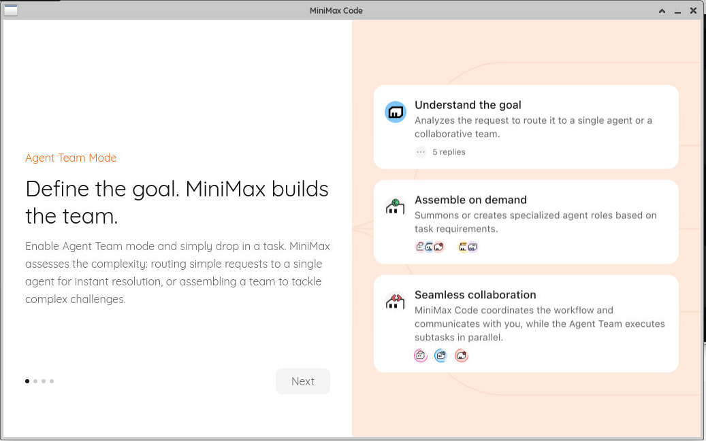
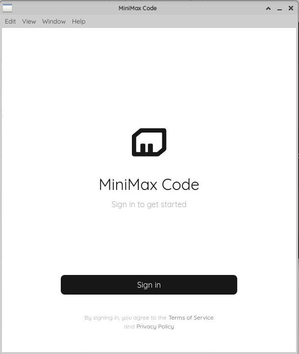
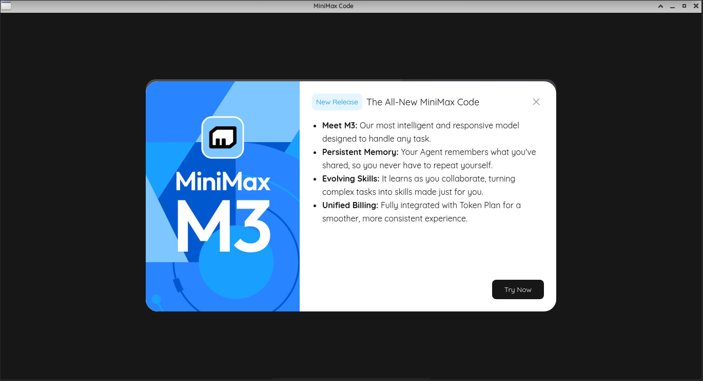
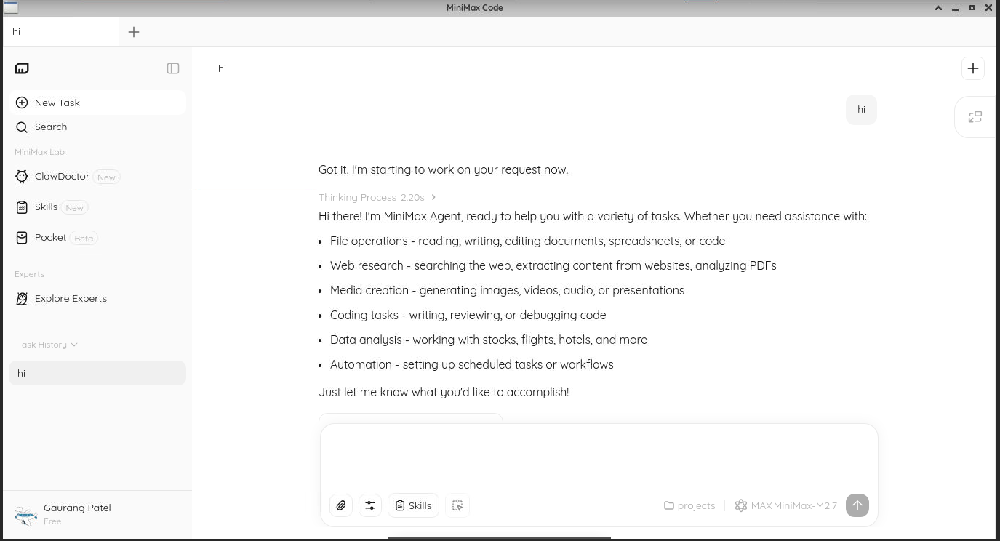

# MiniMax Agent for Linux

<p align="center">
  
  
  
  
</p>

> **Note**: This is an **unofficial port** of MiniMax Agent for Linux. MiniMax does not currently offer an official Linux desktop application. This project aims to bring the MiniMax Agent experience to Linux users.

## Download .deb Package

**Direct Download:** Click on the `.deb` file in the `releases/` folder above, or use:
```bash
wget https://github.com/unn-Known1/minimax-agent-linux/releases/download/v3.0.46/minimax-agent_3.0.46_amd64.deb
```

## Installation

```bash
# Download the package
wget https://github.com/unn-Known1/minimax-agent-linux/releases/download/v3.0.46/minimax-agent_3.0.46_amd64.deb

# Install
sudo dpkg -i minimax-agent_3.0.46_amd64.deb

# Fix dependencies if needed
sudo apt --fix-broken install

# Run setup to download Electron runtime
sudo ./setup.sh

# Launch
minimax-agent
```

## Screenshots [ Working everything in new version ]

<p align="center">
  
  <br/>
  <em>Main application interface</em>
</p>

<p align="center">
  
  <br/>
  <em>Sign in Page</em>
</p>

<p align="center">
  
  <br/>
  <em>Classic mode with credits</em>
</p>

<p align="center">
  
  <br/>
  <em>New mode requires a token plan (may be problem with the linux build!-known issue)</em>
</p>

## Usage Notes

If you're using MiniMax Agent with **credits** and the app is not working in the default mode, try switching to **Classic** mode. The **New** mode may not work with credits alone (possibly requires a token plan, or it could be a Linux build limitation). Classic mode works fully with your existing credits.

- **Classic mode** — works with credits, fully functional
- **New mode** — may require a token plan or might be limited in the Linux build

Use the switch option in the app to toggle between modes.

## Features

- Full MiniMax Agent functionality
- Google OAuth login support
- Custom protocol handler (`minimax://`) for OAuth callbacks
- Desktop integration with app icons
- System tray support
- Daemon process for background tasks
- Skills and agents system
- All features from the Windows version

## Supported Distributions

- Linux Mint (primary tested)
- Ubuntu 20.04+
- Debian 10+
- Other Debian-based distributions with amd64 architecture

## System Requirements

### Minimum Requirements
- 64-bit (amd64) Linux distribution
- 2 GB RAM
- 1 GB free disk space
- libgtk-3-0 and associated libraries

### Dependencies
The package will automatically install required dependencies.

## Uninstallation

```bash
sudo dpkg -r minimax-agent
```

## Troubleshooting

### App shows blank screen
- Clear cache: `rm -rf ~/.config/minimax-agent`

### Google login doesn't complete
- Protocol handler should auto-register. If not:
```bash
xdg-mime default minimax-agent.desktop x-scheme-handler/minimax
```

### App doesn't start
- Check logs: `~/.config/minimax-agent/logs/`
- Run from terminal: `minimax-agent`

## Building from Source

```bash
git clone https://github.com/unn-Known1/minimax-agent-linux.git
cd minimax-agent-linux
chmod +x build.sh
sudo ./build.sh
```

## Contributing

See [CONTRIBUTING.md](CONTRIBUTING.md) for how to help.

## Disclaimer

This is an unofficial port. MiniMax is not affiliated with this project. The original application belongs to [MiniMax](https://www.minimax.io/).

## Links

- [Official MiniMax Agent](https://agent.minimax.io)
- [Report an Issue](https://github.com/unn-Known1/minimax-agent-linux/issues)

---

*Last updated: June 2026*
